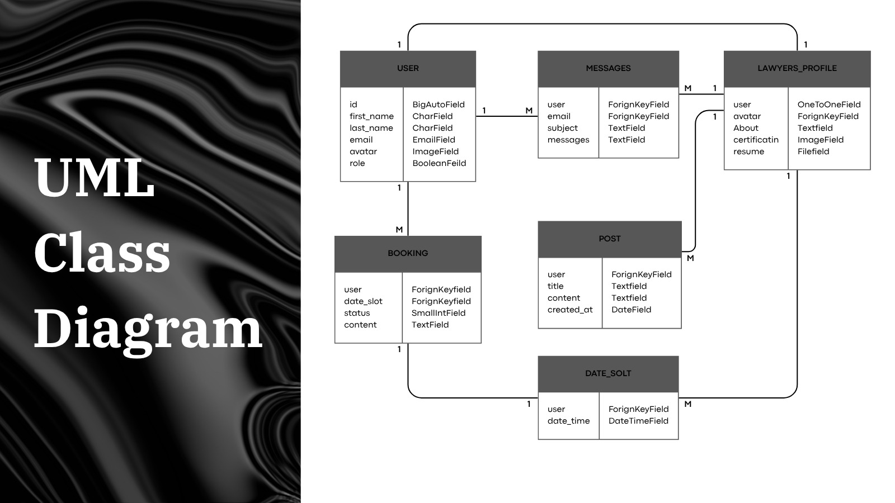

# LegalQistas
Tuwaig python bootcamp duo project

## project idea:
A legal firm's website, offering and highlighting their services and legal educational content with a streamlined method to schedule legal consulting sessions with legal staff

### list of features:
- ability to schedule and book consulting sessions
- ability to view, create, edit and delete blogs
- viewing, editing and deleting profiles of legal staff
- managing and tracking booked sessions
- communicating with staff in booked session and through the website
- sending formal contact requests to the firm through the website
- reciveing notifications on sesssions via email
- dark mode and light mode

### user stories:
[user story](./assets/Unit%203&4%20project%20user%20story.pdf)

### Personas: [ Visitors - Customer - law firm lawyers - law firm manager ]

#### Persona story:
- Visitors: “I want to find and read the firms blogs and to see the profiles and info if their lawyer to see the firms services and evaluate them myself” 
- Customer: “I’m looking for a way to schedule a session with lawyers of my choosing and be able to track and manage this booked session to discuss my legal woes” 
- Law firm lawyer: “I want to be able to make and manage blogs to advertise my expertise, I also want to be able to manage my bookings and schedule my agenda, lastly I want to be able to edit a public profile about me to showcase my resume and ways to contact me”
- Law firm manager: “I want to able to manage the blogs contents and state. And manage users scheduled sessions to be able to reject reschedule and reassign sessions, also I want to be able manage the roles and permissions of firm staff”

#### journeys

User journey: A user will be able to enter the website and see the blogs created by law firm staff, user will also be able to see who made which blog and see their bio, cv, socials and blogs. After registering or registering when making a schedule, user should have access to a page where they will be able to view their scheduled meeting. These pages will have a chat to communicate to the user and every time and a message is sent an email will be sent to the user

Law firm lawyer journey: will be able to manage blogs but not delete, see their schedule but not reject only change status and communicate with their customers, and be able to manage their profiles in terms of links and profile images

Manager journey: have admin rights and be able to alter content, delete and add lawyers, manage bookings; reject - delete - assign - reply

### Class UML

### project Wireframe

